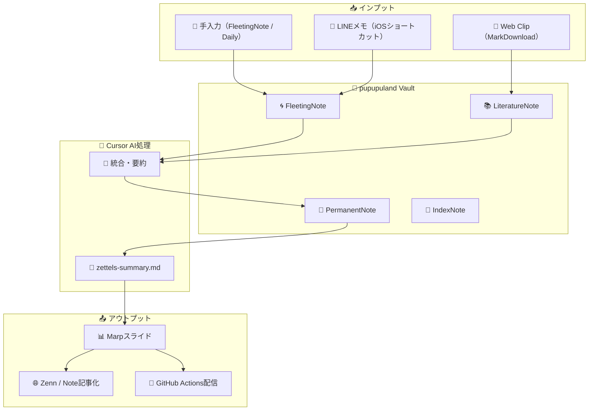

# 🧠 pupupuland — 知的生産を支える Obsidian Vault

## 🏭 概要

**思考・学習・発見の痕跡を、1つの場所に蓄積し、つなぎ、活かす。**  
このリポジトリは、個人の知的活動を続繰的・構造的に支えるために設計された Obsidian Vault です。

Zettelkasten（1ノート1概念）を根心に、日々の気づきや読書、学びの記録を分散させず蓄積。  
Cursor による AI支援と Marp によるスライド出力を組み合わせて、**「記録する」から「伝える」までの循環**を実現します。

---

## 🧹 Vault内構成と役割

|フォルダ|説明|
|---|---|
|`Zettelkasten/`|知識ノート全体の集約場所。以下に分類される|
|┣ `PermanentNote/`|概念・思考の定着ノート（1ノート1アイデア）|
|┣ `FleetingNote/`|一時的なメモ、断片的な気づき|
|┣ `LiteratureNote/`|読書・引用メモ（出典付き）|
|┣ `IndexNote/`|トピック別の目次・分類インデックス|
|┗ `Zettelkasten運用/`|この方式の運用方針、テンプレート等|
|`Daily/`|日々の行動・感情・気づきのログ|
|`LINE/`|LINEショートカット経由で自動で受け取るノート|
|`Template/`|ノート作成用テンプレート|
|`MEMO(Thino)/`|一行メモなど短文で分類されていない軽量メモ|

---

### 🗂 構成図（Vault全体）

```tree
📁 pupupuland Vault
├── 🧠 Zettelkasten/
│   ├── 📄 PermanentNote/
│   ├── 🌀 FleetingNote/
│   ├── 📚 LiteratureNote/
│   ├── 📇 IndexNote/
│   └── 🛠 Zettelkasten運用/
├── 🗓 Daily/
├── 💬 LINE/
├── ✏️ MEMO(Thino)/
├── 🧰 Template/
```

この構成により、**一時的な思考 → 概念化 → 体系化** のプロセスを踏める構造が確保されています。

---

## 🔁 情報の流れ（インプット→構造化→アウトプット）



---

## 🌟 このVaultが目指すもの

- 一時的なメモが知識へと昇華する「思考の変換構造」
    
- GitHubによる履歴管理とマルチデバイス連携
    
- AIによる再構成とアウトプット補助（Cursor）
    
- Zettelkasten構造に基づいた**非階層的な思考リンク**
    
- Markdownベースでそのままプレゼン可能な構成（Marp）
    

---

## 🔗 使用ツールと役割

|ツール|概要|
|---|---|
|**Obsidian**|ノート管理・リンク構造生成|
|**GitHub + obsidian-git**|リモート同期・履歴保存|
|**Cursor**|AIによる編集・要約・構造化|
|**Marp**|Markdownからスライド作成|
|**LINE / WebClipper**|外部インプットの受け取り手段|

---

## 📦 運用ルール（例）

- `FleetingNote/`：何でも一時的に突っ込む場。後で分類・昇格する
    
- `PermanentNote/`：必ず1アイデア1ファイル。双方向リンク意識
    
- `LiteratureNote/`：引用・要約を明示し、解釈も自分の言葉で書く
    
- `IndexNote/`：トピックのハブとして生成・更新
    
- 週次で `zettels-summary.md` を生成 → `Marp` でスライド化
    

---

## 🔭 今後の展望（ToDo）

- GitHub ActionsによるSlides出力自動化
    
- CursorによるZettels要約バッチ処理
    
- WebClip/LINE連携の自動分類スクリプト導入
    
- Zenn投稿向けテンプレ・変換ルール整備
    

---

## 📄 ライセンス

このVaultは個人の知的生産を目的として運用されています。  
外部公開については必要に応じてMITやCCライセンスを適用予定です。

---

