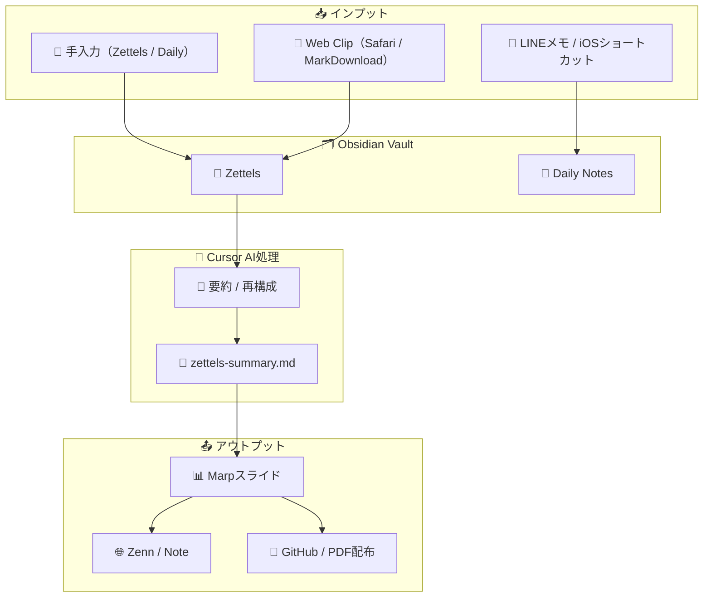

# 🧠 pupupuland — 知的生産を支える Obsidian Vault

## 🏭 概要

**思考・学習・発見の痕跡を、1つの場所に蓄積し、つなぎ、活かす。**
このリポジトリは、個人の知的活動を続繰的・構造的に支えるために設計された Obsidian Vault です。

Zettelkasten（1ノート1概念）を根心に、日々の気づきや読書、学びの記録を分散させず蓄積。
Cursor による AI支援と Marp によるスライド出力を組み合わせて、**「記録する」から「伝える」までの循環**を実現します。

---

## 🧹 Vault内構成と役割

| フォルダ         | 説明                                    |
| ------------ | ------------------------------------- |
| `Zettels/`   | 根となる短く高密度な知識ノート（1ノート1概念）              |
| `Daily/`     | 日々の行動・感情・気づきのログ                       |
| `Logs/`      | 学習や読書など、続繰的な記録を格納（Learning / Reading） |
| `Words/`     | 印象に残った言葉や引用の収集                        |
| `Discovery/` | ふとした直感・発見・ひらめき                        |
| `Slides/`    | Marp形式で出力されたスライドの置き場所                 |
| `Templates/` | ノート作成を助けるテンプレート集                      |
| `Shops/`     | 訪れた場所・お店の記録                           |

---

### 🗂 構成図（Vault全体）

```tree
📁 pupupuland Vault
├── 📂 Core Notes
│ ├── 📘 Zettels（1概念ノート）
│ ├── 📒 Daily（日々の記録）
│ ├── 💡 Discovery（発見・直感）
│ └── 📝 Words（引用・名言）
├── 📂 Logs（記録）
│ ├── 📚 Reading（読書）
│ └── 🎓 Learning（学習）
├── 📂 Output（出力）
│ └── 📑 Slides（Marp形式）
├── 📂 Templates
└── 🏪 Shops（お店・場所メモ）
```

この構成により、**思考の断片を漏れなく記録し、あとから再発見しやすい構造**が生まれます。

---

## 🔁 情報の流れ（インプット→構造化→アウトプット）



> 入力 → 記録 → 構造化 → 要約 → 発信。**思考が自然に循環するフロー**がこのVaultの設計思想です。

---

## 🌟 このVaultが目指すもの

* 記録が知識へと変わる構造を持つこと
* 分散せず、**“使える形”で思考を保存すること**
* GitHubとの連携によって、**マルチデバイス・履歴管理**を両立
* Cursorを使った**AI支援による再構成・編集**
* Marpによる**スライド化＝視覚的発信手段**の確保

---

## 🔗 使用ツールと役割

| ツール                       | 概要                     |
| ------------------------- | ---------------------- |
| **Obsidian**              | Vaultとしてのノート管理・双方向リンク  |
| **GitHub + obsidian-git** | バージョン管理・リモート同期         |
| **Cursor**                | AIによるZettelsの集縮・要約・編集  |
| **Marp**                  | Markdownからスライド化        |
| **LINE / WebClipper**     | 日常の思考断片を即座に取り込むインタフェース |

---

## 📦 運用ルール（例）

* `Zettels/`：1ノート = 1アイデア。双方向リンクを意識する
* `Daily/`：日記とログ。テンプレから自動生成
* `Logs/`：まとまった読書や学習に記録フォルダを分離
* `Slides/`：週1で `zettels-summary.md` を作成 → Marpでスライド化

👉 これらは、Obsidianのテンプレート機能とGitの自動同期を活用して、**反復可能で手間の少ない運用**に設計されています。

---

## 🔭 今後の展望（ToDo）

* GitHub Actionsでの `Slides/*.md → PDF/HTML` 自動出力
* CursorとZettelsの自動連携ルール作成（定期集縮）
* WebClip / LINEメモのObsidian自動反映（ショートカット強化）
* `Zenn_Templates/` など記事投稿構成の導入

---

## 📄 ライセンス

このVaultは個人の知的生産を目的として運用されています。
外部公開については必要に


