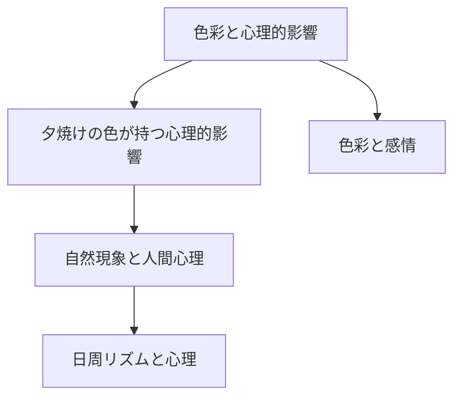

# 色彩と心理的影響

## 概要
色彩が人間の心理や感情に与える影響についての探究。特に自然現象における色彩の役割と、その心理的・生理的・文化的な意味について。

## 主要な発見
### 1. 色彩の多層的影響
- 心理的影響
  - 暖色系（茜色など）は心理的な温かみを伝達 → [[夕焼けの色が持つ心理的影響]]
  - 色彩のグラデーションは視覚的な快感を生む

### 2. 生理的メカニズム
- 自然の色彩変化と生体リズム
  - 夕焼けの色は休息のシグナルとして機能
  - 進化的に獲得された反応パターン

### 3. 文化的な意味づけ
- 芸術的表現における色彩
  - 詩的モチーフとしての活用
  - 文化的シンボルとしての役割

## オープンクエスチョン
1. 色彩が持つ普遍的な心理効果と文化依存的な効果の区別
2. 現代社会における自然の色彩シグナルの意味変容
3. デジタル環境での色彩体験の特殊性

## 関連する研究領域
- 色彩心理学
- 進化心理学
- 文化人類学
- 芸術理論

## メモ間の関係性

## 今後の探究方向
1. 色彩の生理的影響の科学的検証
2. 異文化間での色彩認識の比較研究
3. 現代のデジタル環境における色彩効果 